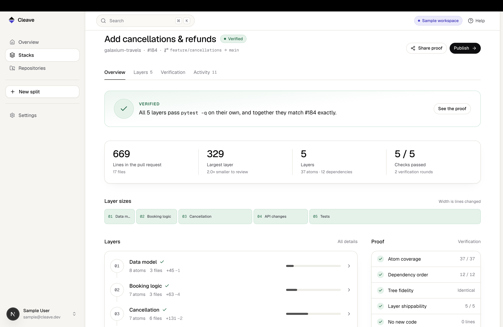
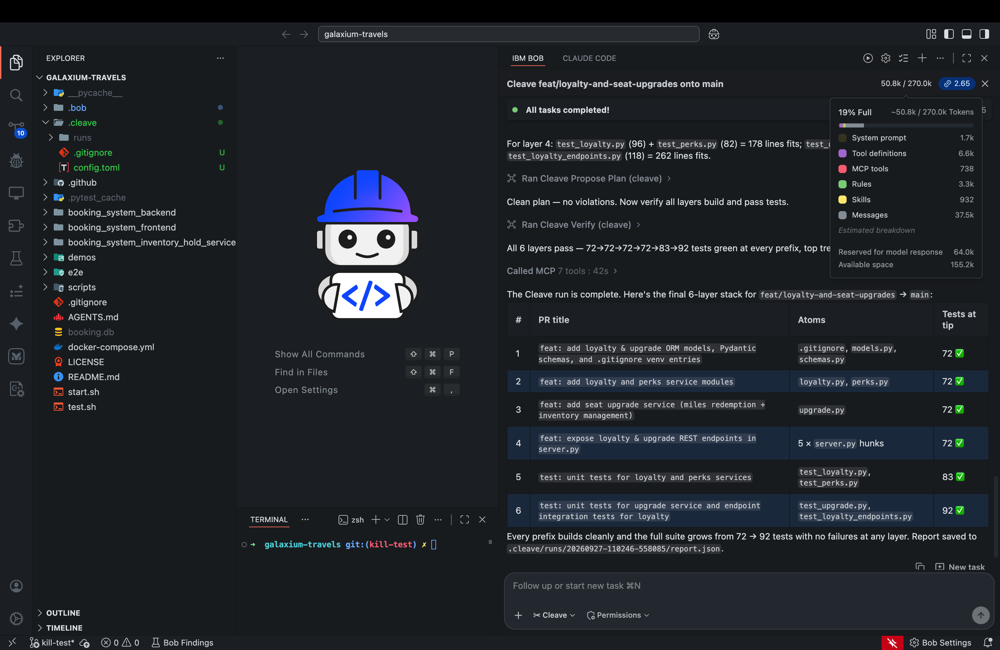
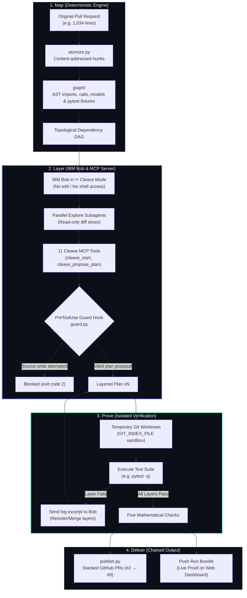

<p align="center">
  
</p>

<h1 align="center">Cleave</h1>

<p align="center">
  <strong>Large pull requests, reviewed as small, proven steps.</strong>
</p>

<p align="center">
  <a href="https://github.com/edish-github/Cleave/actions/workflows/ci.yml"></a>
  <a href="https://cleave-sable.vercel.app"></a>
  <a href="https://cleave-sable.vercel.app/results"></a>
  <a href="https://github.com/edish-github/Cleave/blob/main/LICENSE"></a>
  <a href="https://lablab.ai"></a>
</p>

---

Coding agents generate pull requests too massive for humans to review. A 1,000-line diff sits open for weeks, undergoes superficial skimming, and introduces silent regressions into production. 

**Cleave** solves this by splitting an oversized pull request into an atomic stack of small, logically ordered pull requests. Every single layer passes the repository's tests on its own, and the final layer is **100% byte-identical** to the original change.

IBM Bob decides how to group and sequence hunks, but operates in a sandboxed mode with **zero source-code write tools**. The engine handles all git manipulation deterministically: the worst a sub-optimal plan can do is fail verification. **It is mathematically impossible for Cleave to hallucinate or corrupt code.**

---

## Visual Showcase

<div align="center">
  <p><strong>1. The Stack Overview: Every Layer Independently Verified</strong></p>
  
  <p><em>Real stack overview in the deployed Cleave web dashboard showing 6 shippable layers with monotonic test progression.</em></p>
</div>

<br/>

<div align="center">
  <p><strong>2. IBM Bob in ✂ Cleave Mode: Sandboxed Partitioning via MCP</strong></p>
  
  <p><em>Real Bob IDE session: 15 atoms partitioned into 6 layers, 72 &rarr; 92 tests green, 0 foreign lines, consuming 2.65 Bobcoins.</em></p>
</div>

---

## Architecture & How It Works

Cleave follows a strict tripartite lifecycle: **Map &bull; Layer &bull; Prove**.



### The Three Stages:
1. **Map (Deterministic Engine):**
   The diff is decomposed into atomic units (one hunk or one entire new file). The engine parses Python ASTs, symbol tables, and pytest fixtures to build a strict dependency graph. Independent hunks within the same file remain uncoupled, maximizing Bob's reordering freedom.
2. **Layer (IBM Bob in ✂ Cleave Mode):**
   Bob reads the diff through parallel, read-only explore subagents. Bob groups atoms into cohesive layers (e.g. Models &rarr; Services &rarr; Endpoints &rarr; Tests) using 11 custom MCP tools over stdio JSON-RPC. A pre-tool guard hook strictly blocks all file modifications.
3. **Prove (Isolated Verification):**
   Every prefix of the stack is checked in an isolated temporary git worktree. If a layer fails, Bob inspects the log excerpt and reallocates atoms. Cleave **never writes glue code or mock patches**; if a layer cannot pass independently, it is merged with its neighbour.

---

## The Five Deterministic Invariants

Every Cleave stack is validated against five mathematical invariants before acceptance:

| Check | What It Enforces | Verification Rule |
| :--- | :--- | :--- |
| **1. Atom Coverage** | Zero dropped or duplicated changes | Every diff atom appears in exactly one layer of the stack. |
| **2. Dependency Order** | Zero broken references or circularity | Topological order holds; no layer references symbols introduced later. |
| **3. Tree Fidelity** | 100% preservation of author's intent | The top layer's git tree SHA equals the original PR commit (`git diff` is empty). |
| **4. Layer Shippability** | Independent green CI at every layer | Every intermediate layer passes the test suite in an isolated worktree. |
| **5. No Foreign Code** | Zero AI-hallucinated glue code | Exactly 0 foreign lines exist in the stack that weren't in the original diff. |

> **Why unit tests alone are not enough:** During our baseline evaluation, unaided Bob produced a stack that passed every unit test, but placed consumer code *before* the service definition it depended on. Tests alone missed it. Cleave's **Dependency Order** check caught it instantly.

---

## Empirical Benchmark: Cleave vs. Bob Alone (B1 Baseline)

To evaluate whether Cleave outperforms unaided agent workflows, we compared Cleave head-to-head against **B1** (`bob run --mode agent`, prompted to split the diff into stacked branches). Both were evaluated across three real commit histories using the exact same five checks:

| Diff & Source | Run | Valid Stack | Green Layers | Foreign Lines | Largest Layer | Bobcoins | Live Proof |
| :--- | :--- | :---: | :---: | :---: | :---: | :---: | :---: |
| **click-deprecated-params**<br>`pallets/click` · 472 lines | **Cleave**<br>Bob Alone (B1) | **Valid ✅**<br>Invalid ❌ | **3 / 3**<br>1 / 2 | **0**<br>0 | **220**<br>298 | **1.40**<br>1.90 | [Proof](https://cleave-sable.vercel.app/proof/click-0286eba) |
| **click-completions**<br>`pallets/click` · 1,055 lines | **Cleave**<br>Bob Alone (B1) | **Valid ✅**<br>Invalid ❌ | **2 / 2**<br>2 / 3 | **0**<br>0 | **895**<br>623 | **1.60**<br>2.20 | [Proof](https://cleave-sable.vercel.app/proof/click-dc3dbd0) |
| **galaxium-lint-pass**<br>`galaxium-travels` · 218 lines | **Cleave**<br>Bob Alone (B1) | **Valid ✅**<br>Invalid ❌ | **2 / 2**<br>0 / 3 | **0**<br>0 | **207**<br>191 | **1.20**<br>1.70 | [Proof](https://cleave-sable.vercel.app/proof/galaxium-travels-4886726) |

### Key Benchmark Takeaways:
* **100% Reliability:** Cleave achieved **3 / 3 valid stacks (100%)**, whereas unaided Bob went **0 / 3 (0%)**, consistently failing on intermediate test breaks and circular dependencies.
* **Higher Cost Efficiency:** Cleave consumed **~28% fewer Bobcoins** (4.2 total across all diffs vs. 5.8 for B1) because the dependency graph guides Bob directly to valid proposals without random trial-and-error.

---

## Live Evidence & Deliverables

Every claim in this repository is backed by live, public, reproducible evidence:

| Milestone | Deliverable | Live Verification Link |
| :--- | :--- | :--- |
| **M1** | Verified Cleave Demo Run | [Public Proof: Galaxium PR #1](https://cleave-sable.vercel.app/proof/galaxium-travels-1) (15/15 atoms, 18/18 deps, 5/5 green layers, 0 foreign lines) |
| **M2** | Stacked Pull Requests | [Chained GitHub PRs](https://github.com/edish-github/galaxium-travels/pulls) ([#2](https://github.com/edish-github/galaxium-travels/pull/2) &rarr; [#3](https://github.com/edish-github/galaxium-travels/pull/3) &rarr; [#4](https://github.com/edish-github/galaxium-travels/pull/4) &rarr; [#5](https://github.com/edish-github/galaxium-travels/pull/5) &rarr; [#6](https://github.com/edish-github/galaxium-travels/pull/6)) |
| **M3** | Head-to-Head Evaluation | [Live /results Table](https://cleave-sable.vercel.app/results) comparing Cleave vs. B1 baseline across 3 diffs |
| **M4** | Bob IDE Session Evidence | Committed task screenshot: [`bob_sessions/SsnFall_task08_first-cleave-run_summary.png`](bob_sessions/SsnFall_task08_first-cleave-run_summary.png) |
| **CI** | Comprehensive Test Suite | [GitHub Actions Workflow](https://github.com/edish-github/Cleave/actions): 155 pytest specs + contracts check + Next.js build |
| **Data** | Evaluation Bundles | [`demo/runs/`](demo/runs/), [`eval/baselines/`](eval/baselines/), [`eval/runs/`](eval/runs/), [`eval/open-checks.md`](eval/open-checks.md) |

---

## IBM Bob Integration Details

Cleave is engineered specifically to harness and constrain IBM Bob:

```
.bob/
├── custom_modes.yaml      # Defines ✂ Cleave mode (removes edit/terminal tools)
├── mcp.json               # Registers cleave MCP server on stdio
├── settings.json          # Wires lifecycle hooks
└── hooks/
    ├── guard.py           # PreToolUse hook: blocks any file modifications (exit code 2)
    └── audit.py           # PostToolUse hook: logs all tool invocations to events.ndjson
```

* **✂ Cleave Custom Mode:** Explicitly removes `edit_file`, `write_file`, and `run_command`. Bob is incapable of editing source code or executing shell commands during a split.
* **11 MCP Tools:** Cleave exposes structured tools (`cleave_start`, `cleave_slice`, `cleave_graph`, `cleave_propose_plan`, `cleave_move_atom`, `cleave_verify`, `cleave_describe_layer`, `cleave_finish`) over stdio JSON-RPC.
* **Tamper-Proof Audit Hook:** Every tool call, parameter, and hook evaluation is streamed to `.cleave/runs/<run_id>/events.ndjson`, verified upon bundle ingestion.

---

## Repository Map

```
Cleave/
├── AGENTS.md                         # Engineering manual & phase rules
├── README.md                         # Product specification & evidence
├── schemas/                          # atom, graph, plan, report, event, bundle (.schema.json)
├── bob_sessions/                     # SsnFall_task08_first-cleave-run_summary.png
├── demo/                             # Galaxium PR #1 demo runbook & committed bundle
├── eval/                             # Head-to-head evaluation suites vs B1 baseline
│   ├── datasets.toml                 # Four constructed diffs (click ×3, Galaxium)
│   ├── baselines/                    # B1 stats and run evaluations
│   └── runs/                         # Committed evaluation bundles
├── packages/engine/                  # Python 3.11 engine (uv)
│   ├── src/cleave/
│   │   ├── gitio.py atomize.py       # Git plumbing & atomization (0 dirty tree writes)
│   │   ├── graph/                    # Python AST & pytest fixture dependency graph
│   │   ├── plan.py verify.py         # Plan store & parallel worktree verification
│   │   ├── mcp_server.py             # 11 tools exposed to IBM Bob via MCP
│   │   ├── publish.py                # Automated chained GitHub PR creation
│   │   └── bob_config/               # Shipped Bob mode, hooks, and rules
│   └── tests/                        # 155 unit & integration specs (CI green)
└── apps/web/                         # Next.js 16 + Postgres (Neon) web dashboard
    ├── src/app/                      # Landing, /proof/:id, /results, /app, /docs/bob
    └── src/server/                   # Database, ingest, GitHub API integration
```

---

## Quickstart & Reproducibility

### 1. Engine & Verification Suite
```bash
# Clone and setup the engine
git clone https://github.com/edish-github/Cleave.git
cd Cleave/packages/engine

# Install dev dependencies with uv
uv sync --extra dev

# Run the 155 unit specs (the CI suite)
uv run pytest -q

# Install cleave as an editable CLI tool
uv tool install --editable .
cleave --version
```

### 2. Run Cleave in Bob IDE on Any Repository
```bash
cd /path/to/target-repo
git checkout main && git pull

# Initialize Cleave for your repo and test runner
cleave init --check "pytest -q" --workdir .

# Reload Bob IDE, switch to the ✂ Cleave mode, and send:
Cleave <feature-branch> onto main
```

### 3. Run the Web Dashboard
```bash
cd apps/web
npm ci
cp .env.example .env.local
npm run dev
# Open http://localhost:3000
```

---

## License

MIT © Team SsnFall · IBM Bob Hackathon 2026
